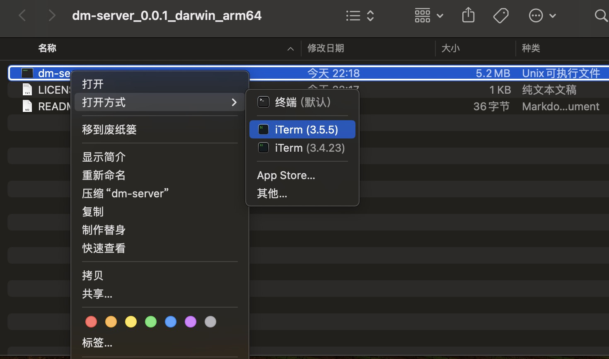

# dm
任何地点一起看弹幕
# 说明
项目代码基于 [trae](https://traeide.com/) 生成, 分为插件端和服务端, 插件端用于发送弹幕获取请求, 服务端用于转发请求.

当前版本耗时: 2025-03-09 的 8:00 左右到 2025-03-10 的早上 1:30

# 使用方式
## 安装插件 dm
1. `git clone https://github.com/Jinof/dm`
1. chrome 浏览器打开: `chrome://extensions`
2. 开启`开发者模式`
3. 选择`加载已解压的扩展程序`
4. 选择 dm 文件夹
## 启动 dm-server
### 通过打包好的 release 启动
1. 打开 [https://github.com/Jinof/dm-server/releases](https://github.com/Jinof/dm-server/releases), 下载对应版本的 dm-server
2. 在命令行执行 `./dm-server` 

⚠️ macos 用户需要可能会遇到恶意软件提示
可在访达中执行，选择执行方式为终端

### 通过代码启动
1. `git clone https://github.com/Jinof/dm-server`
2. `go run main.go // 用于转发获取弹幕请求`

# FAQ
## 为什么需要服务端？
bilibili 的弹幕接口是 GET 请求, 但是带有 body, 不是标准的 HTTP 协议, 浏览器无法直接执行, 所以通过服务端转发请求.